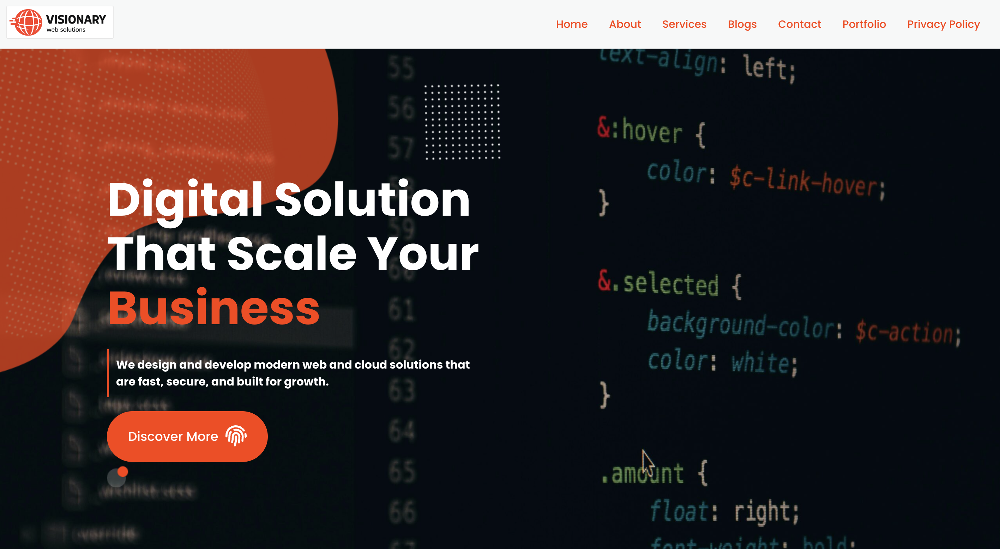
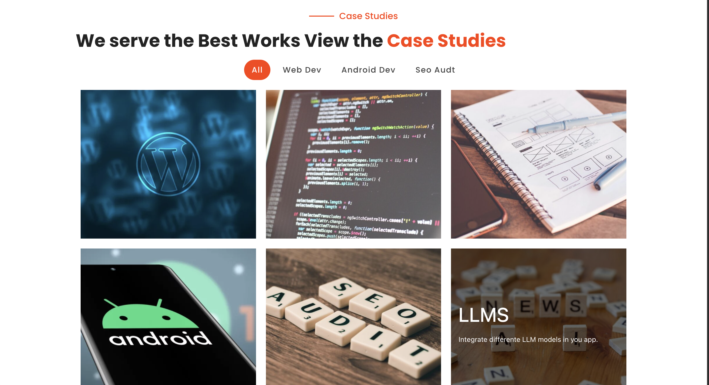
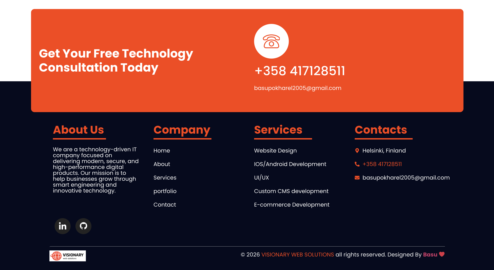
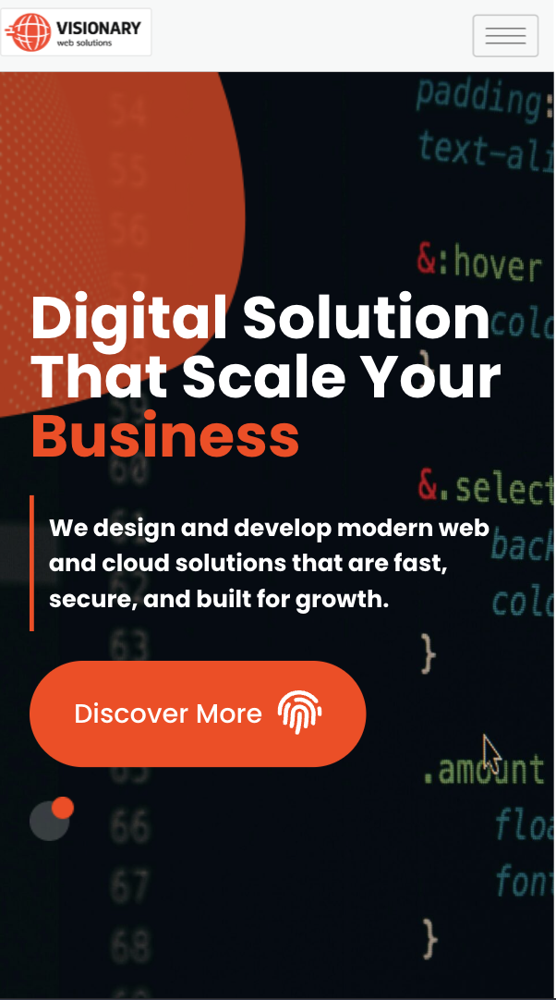
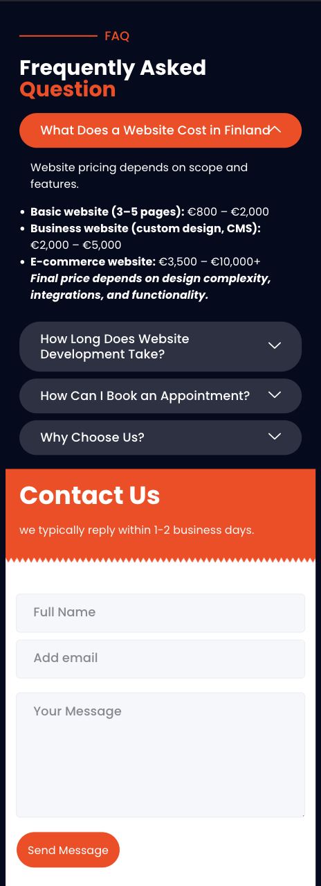

# Visionary Web Solutions – Company Website

Official WordPress website for Visionary Web Solutions.  
This project represents a modern, responsive, and performance-focused business website built to showcase professional web development services.

---

Live Link: [CLick to view](https://vws-smoky.vercel.app/)

## 🌐 Project Overview

Visionary Web Solutions is **MY FUTURE** web development company website designed to:

- Present web development services
- Showcase business-focused solutions
- Publish SEO-friendly blog content
- Provide contact and inquiry functionality
- Deliver a responsive user experience across all devices

The website is built using WordPress with a focus on clean structure, usability, and scalability.

---

## 🚀 Features

- Responsive Design (Mobile-First)
- Service Pages
- Blog Section
- Contact Integration (mailto / form)
- Optimized UI Layout
- Structured Content Architecture
- SEO-Friendly Content Structure

---

## 🛠 Tech Stack

- WordPress (CMS)
- HTML5
- CSS3
- Responsive Design Principles
- Basic Performance Optimization
- Git for Version Control

---

## 🎯 Business Objective

The purpose of this website is to:

- Establish online credibility
- Generate business leads
- Demonstrate web development expertise
- Support digital marketing efforts

---

## 📈 Future Improvements

- Advanced SEO optimization
- Performance enhancements
- Custom theme development
- Enhanced contact automation
- Analytics integration

---

## 👨‍💻 Author

Developed by [**Basu**](https://www.linkedin.com/in/basudev-pokharel/)

---

## 👀 preview

### 🖥️ Desktop Pages

Here are examples of the desktop layout for Visionary Web Solutions:

  
  

### 📱 Mobile Pages

Here are examples of the mobile layout for Visionary Web Solutions:

  
  

---

## Visit my Social Sites

[LInkedIN](https://www.linkedin.com/in/basudev-pokharel/)
